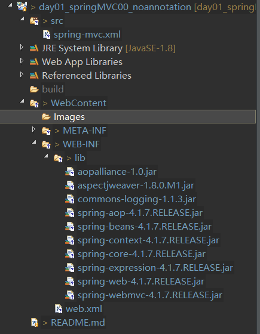
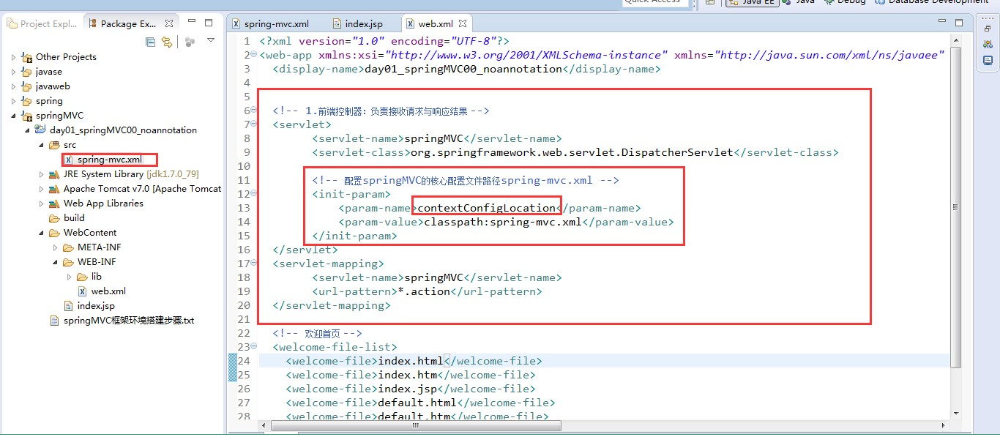
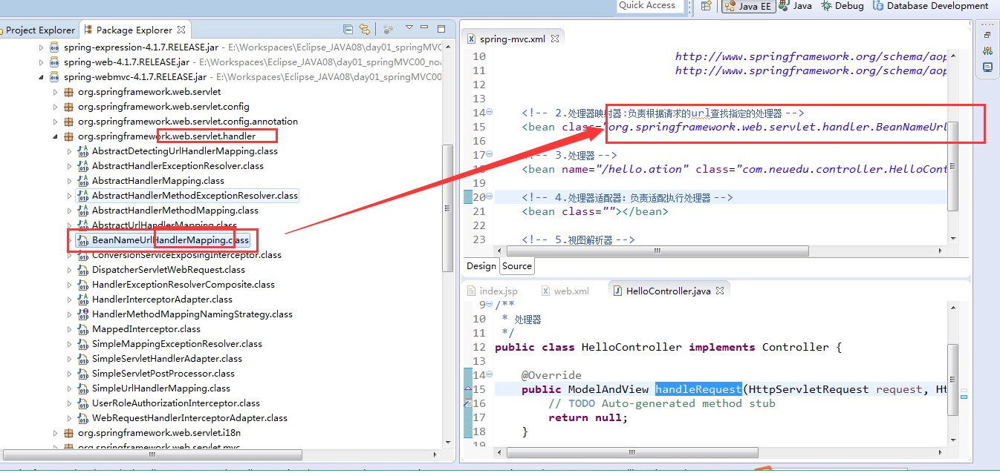
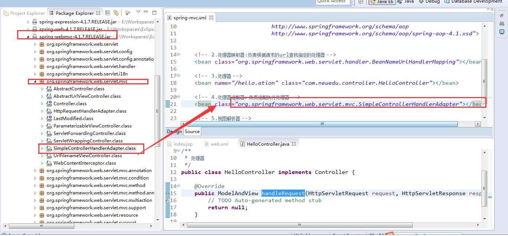
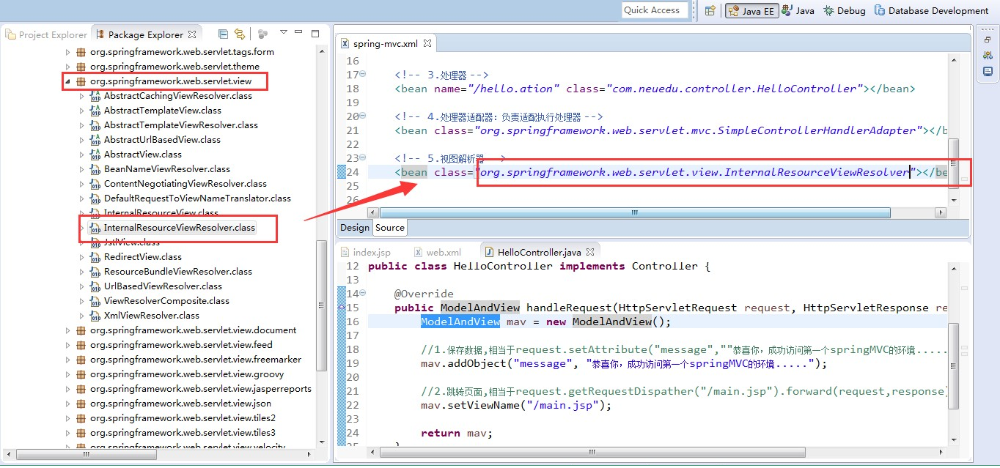

# springMVC环境搭建

#### 1. 导入对应的包



#### 2. src下新建spring-mvc.xml

```xml
<?xml version="1.0" encoding="UTF-8"?>
<beans xmlns="http://www.springframework.org/schema/beans"
	   xmlns:context="http://www.springframework.org/schema/context"
	   xmlns:aop="http://www.springframework.org/schema/aop"
	   xmlns:xsi="http://www.w3.org/2001/XMLSchema-instance"
	   xsi:schemaLocation="http://www.springframework.org/schema/beans 
	                       http://www.springframework.org/schema/beans/spring-beans-2.5.xsd
	                       http://www.springframework.org/schema/context
	                       http://www.springframework.org/schema/context/spring-context-4.1.xsd
	                       http://www.springframework.org/schema/aop
	                       http://www.springframework.org/schema/aop/spring-aop-4.1.xsd">


</beans>
```
#### 3. 配置web.xml



```xml
<?xml version="1.0" encoding="UTF-8"?>
<web-app xmlns:xsi="http://www.w3.org/2001/XMLSchema-instance" xmlns="http://java.sun.com/xml/ns/javaee" xsi:schemaLocation="http://java.sun.com/xml/ns/javaee http://java.sun.com/xml/ns/javaee/web-app_3_0.xsd" version="3.0">
  <display-name>day01_springMVC00_noannotation</display-name>
  
  <!-- 1. 前端控制器:负责接收请求与响应结果 -->
  <servlet>
  		<servlet-name>springMVC</servlet-name>
  		<servlet-class>org.springframework.web.servlet.DispatcherServlet</servlet-class>
  		
  		<!-- 配置springMVC的核心配置文件路径spring-mvc.xml -->
  		<init-param>
  			<param-name>contextConfigLocation</param-name>
  			<param-value>classpath:spring-mvc.xml</param-value>
  		</init-param>
  </servlet>
  
  <servlet-mapping>
  		<servlet-name>springMVC</servlet-name>
  		<url-pattern>*.action</url-pattern>
  </servlet-mapping>
  
  
  <!-- 欢迎首页 -->
  <welcome-file-list>
    <welcome-file>index.html</welcome-file>
    <welcome-file>index.htm</welcome-file>
    <welcome-file>index.jsp</welcome-file>
    <welcome-file>default.html</welcome-file>
    <welcome-file>default.htm</welcome-file>
    <welcome-file>default.jsp</welcome-file>
  </welcome-file-list>
</web-app>
```

#### 4. 配置spring-mvc.xml







```xml
<?xml version="1.0" encoding="UTF-8"?>
<beans xmlns="http://www.springframework.org/schema/beans"
	   xmlns:context="http://www.springframework.org/schema/context"
	   xmlns:aop="http://www.springframework.org/schema/aop"
	   xmlns:xsi="http://www.w3.org/2001/XMLSchema-instance"
	   xsi:schemaLocation="http://www.springframework.org/schema/beans 
	                       http://www.springframework.org/schema/beans/spring-beans-2.5.xsd
	                       http://www.springframework.org/schema/context
	                       http://www.springframework.org/schema/context/spring-context-4.1.xsd
	                       http://www.springframework.org/schema/aop
	                       http://www.springframework.org/schema/aop/spring-aop-4.1.xsd">

		<!-- 2. 处理映射器:负责根据请求的url查找指定的处理器-->
		<bean class="org.springframework.web.servlet.handler.BeanNameUrlHandlerMapping"></bean>
		
		<!-- 3. 处理器 -->
		<bean name="/hello.action" class="com.tencent.controller.HelloController"></bean>
		<!-- 4. 处理适配器 -->
		<bean class="org.springframework.web.servlet.mvc.SimpleControllerHandlerAdapter"></bean>
		<!-- 5. 视图解析器 -->
		<bean class="org.springframework.web.servlet.view.InternalResourceViewResolver"></bean>
</beans>
```
#### 5. 写对应的JAVA以及前端代码

```Java
package com.tencent.controller;

import javax.servlet.http.HttpServletRequest;
import javax.servlet.http.HttpServletResponse;

import org.springframework.web.servlet.ModelAndView;
import org.springframework.web.servlet.mvc.Controller;

/**
 * 
* <p>Title: HelloController</p>  
* <p>
*	Description: 
*   	处理器
* </p> 
* @author xianxian 
* @date 2019年10月15日
 */
public class HelloController implements Controller {

	@Override
	public ModelAndView handleRequest(HttpServletRequest arg0, HttpServletResponse arg1) throws Exception {

		ModelAndView mav = new ModelAndView();
		
		//1. 保存数据，相当于request.setAttribute("message",""恭喜你，成功访问第一个springMVC环境........"");
		mav.addObject("message","恭喜你，成功访问第一个springMVC环境........");
		
		//2. 跳转页面,相当于request.getRequestDispather("/main.jsp").forward(request.response);
		mav.setViewName("/main.jsp");
		
		
		return mav;
	}

}

```

```Jsp
<%@ page language="java" contentType="text/html; charset=UTF-8"
    pageEncoding="UTF-8"%>
<!DOCTYPE html>
<html>
<head>
<meta charset="UTF-8">
<title>Insert title here</title>
</head>
<body>
	<a href="hello.action">点击链接访问springMVC环境</a>
</body>
</html>
```

```Jsp
<%@ page language="java" contentType="text/html; charset=UTF-8"
    pageEncoding="UTF-8"%>
<!DOCTYPE html>
<html>
<head>
<meta charset="UTF-8">
<title>Insert title here</title>
</head>
<body>
	${message}
</body>
</html>
```

#### 6. 运行项目


